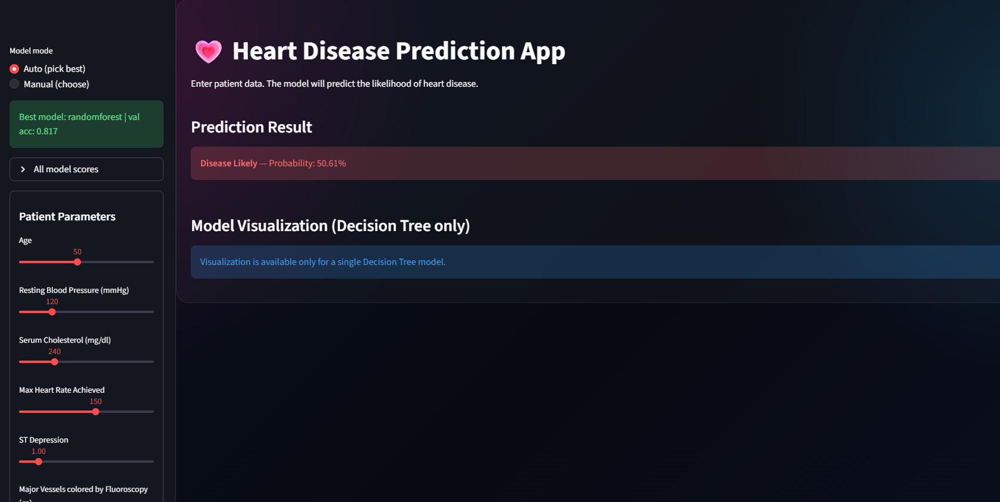

# Heart Disease Prediction (Streamlit)

A Streamlit web app that predicts the likelihood of heart disease from patient parameters.
Supports multiple ML pipelines (AdaBoost, RandomForest, GradientBoosting, XGBoost) saved as `.joblib`.

## 🌐 Live Demo
👉 [Try the app here](https://heart-disease-prediction-c3ruqi2bkcwzd949snlw6e.streamlit.app/)

⚠️ Note: The app may take a few seconds to wake up if it has been inactive.

## Problem
Given structured clinical data, build a classification model to predict the presence of heart disease.

## Approach
- Built and compared multiple machine learning models:
  - AdaBoost
  - Random Forest
  - Gradient Boosting
  - XGBoost
- Applied feature engineering and evaluated model performance
- Deployed the best-performing pipeline as a Streamlit web application

## Results
- Dataset: UCI Heart Disease Dataset
- Best Model: RandomForest
  
- Validation Accuracy: ~0.82
- Test Accuracy: ~0.84
  
- Precision / Recall / F1-score: ~0.84 on test set
- Notes: Model selection is based on validation performance after feature engineering.

## Limitation
- Performance depends on dataset quality and feature selection  
- May not generalize well to unseen populations without further validation

## Features
- Input patient parameters in sidebar form
- Load saved ML pipelines from `models/`
- Auto-pick best model or manual model selection
- Show prediction probability (if supported by the model)

## Demo
Example prediction from the deployed Streamlit app:



## Project Structure
- `deploy.py` : Streamlit app
- `models/` : saved pipelines (`*.joblib`)
- `notebooks/` : training notebooks
- `requirements.txt` : dependencies

## How to Run Locally
1. Install dependencies:
```bash
pip install -r requirements.txt
```

2. Run Streamlit app:
```bash
streamlit run deploy.py
```

```md
Then open: http://localhost:8501
